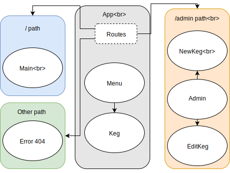

Notes on issues during the project (Alternate title: times my first guess as to what the error was was totally wrong):  
* Had an unexpected error in getting my code to initially run, with an error that was (to me) ambiguous; did some googling, but after a more careful examination file-by-file I determined that I'd created an empty template.ejs file but neglected to fill it with anything.

* Had an extra )} appear after the menu in both the Admin and Main pages; my first thought it was at the end of Menu and the closing brackets therein in exactly that pattern.  Those were fine and not printing; I'd made the error in Main outside and after the call to Menu, not initially noticed it, then cut and pasted it into the nearly-identical new Admin page.

* I had a long period in which I was unable to get handleEditKeg to see the masterKegList.  I looked everything over and could see no reason why App wouldn't see it, and read up on the topic to no avail.  The code appeared to be recompiling correctly when I edited it in atom.  Then, when I broke out in console and reran npm, it worked.  I have no explanation for why it wasn't working before.

* Tried a number of unsatisfying ways to pass the id of the selected Keg up from KegEdit to App - then realized it was already in state and I could access it directly without any trouble at all.
